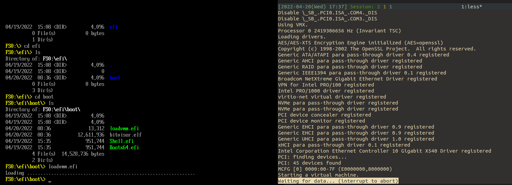

# Normal boot on VMWare

This readme describes how to run BitVisor on VMWare.

This method would be the easiest way if you just wanna try running hypervisor first time.

## Environments

- Any host machine with AMD/Intel CPUs which support virtualization (Intel VT-x etc).
- Any host commodity OS
- Any guest commodity OS image
- VMWare

**This method would work for almost any platforms, any host/guest OS, and any variants of VMWare**. However, below instructions are based on these environments.

- Physical CPU: Intel Core i9 (12th Gen), supporting both VT-x and VT-d
- Host OS: Ubuntu 22.04, kernel 5.15.0-25-generic
- Guest OS: Ubuntu 20.04 LTS
- VMWare Workstation 16 Player (`16.2.3build-19376536`)

## Build BitVisor

Fetch BitVisor, build loader binary (EFI application) and BitVisor binary (ELF):

```bash
git clone https://github.com/matsu/bitvisor # needs mingw64-gcc
cd ./bitvisor
make config # Enable `TTY_SERIAL` here
make -j24
make -C boot/loader -j24
make -C boot/uefi-loader -j24

cp ./boot/uefi-loader/loadvmm.efi .
```

Or you can just download pre-built nightly builds from [here](https://www.bitvisor.org/).

## Download EFI shell

Downlaod EFI shell from [here](https://github.com/tianocore/edk2/raw/UDK2018/ShellBinPkg/UefiShell/X64/Shell.efi), and name it as `Shell.efi`.

## Create Virtual Machine

First, create a virtual machine on VMWare. Here, no need to install guest OS.


Any hardware size is OK.

## Format virtual hardware for EFI

You have to format a virtual hardware for EFI partition. Here, we use [Ubuntu installer image](https://ubuntu.com/download/desktop).

1. Download latest Ubuntu Desktop iso image and insert the image into virtual CD/DVD drive.


2. Assign any number of CPU cores to VM, enable virtualization (IOMMU virtualization is optional).


3. Power on the VM, enter to Ubuntu installer (do not select `install Ubuntu` here, just choose `Try Ubuntu`).


4. To format virtual drive, execute `sudo gdisk`. Format `/dev/sda` as below:

```txt
> o # Create GPT
> n # Add new partition
  Partition number: 1
  First sector: Enter (default)
  Last sector: +1GB # (large size enough for EFI applications)
  Hex code or GUID: ef00 # EFI system partition
> p # check created partition
> w # apply change
```


5. Step.4 creates `/dev/sda1` partition. Format it as FAT32.

```bash
sudo mkfs.vfat -F 32 /dev/sda1
```

6. Mount `/dev/sda1`. Create `/efi/boot` directory.

```bash
mkdir /tmp/hoge && mount /dev/sda1 /tmp/hoge && cd /tmp/hoge
mkdir -p ./efi/boot
```

## Install BitVisor in EFI partition

1. Mount virtual disk on anyware in the host.


2. Copy `loadvmm.efi` and `bitvisor.elf` under `/efi/boot`.

```bash
cd /tmp/hoge/efi/boot # mount point
sudo cp <path-to-bitvisor>/loadvmm.efi <path-to-bitvisor>/bitvisor.elf ./
sudo cp <path-to-download-dir-of-Shell.efi>/Shell.ef ./
sudo cp ./Shell.efi Bootx64.efi
```

3. Unmount virtual disk


## Configure virtual machine

VMWare workstation player has really poor GUI for configuration, so you have to edit `.vmx` file directly. The location of  `.vmx` differs based on your OS. In my case (Ubuntu host), it is located at `$HOME/vmware/<VM name>/<VM name>.vmx`.

1. Remove printer from GUI configuration. (BitVisor uses serial port 0 for its debug log)

2. Edit `<VM name>.vmx` file and add below:

```txt
## Config for BitVisor ############

# Use UEFI

firmware="efi"

# debug serial
serial0.fileType = "file"
serial0.fileName = "/tmp/bitvisor_serial"
serial0.present= "TRUE"

# ipxe boot

bios.bootDelay = "5000"

## (END) Config for BitVisor ############
```

## Enter to EFI shell

1. Power on VM, which would enters to EFI shell:


2. Exec `loadvmm.efi`, which initializes BitVisor and backs to EFI shell:

```txt
> fs0:
> cd ./efi/boot
> .\loadvmm.efi
```




## TODO
